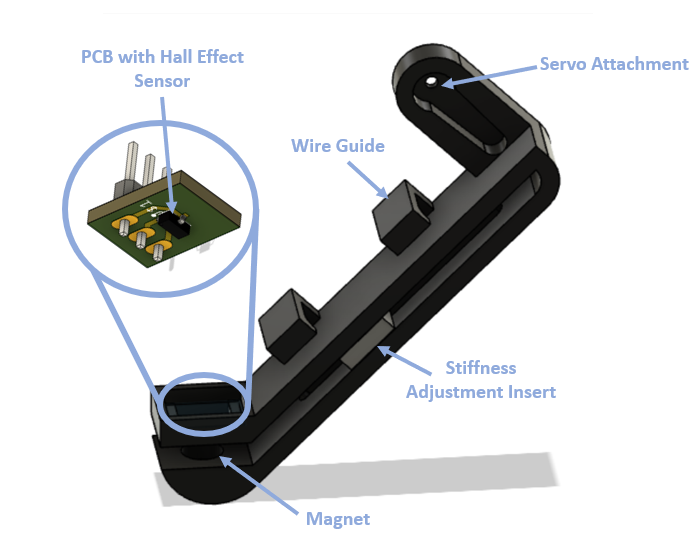

# Welcome!

This humble corner of the internet contains a collection of my undergraduate work thus far, ranging from coursework for classes such as ME 331: Instrumentation and Data Acquisition to my research on quadruped robots. 

## Resume

For a quick summary of my work and experiences, you can take a look at my <a href="documents/Gabrielle-Conard-Resume.pdf" target="_blank">resume.</a> You can also check out my [LinkedIn profile](https://www.linkedin.com/in/gabrielle-conard/).

## Quadruped Robots

### Lafayette OpenDog

For me, this is where it all began. Inspired by James Bruton's [openDog](https://youtube.com/playlist?list=PLpwJoq86vov_PkA0bla0eiUTsCAPi_mZf), I collaborated with [Professor Alexander Brown](https://github.com/Alexanderallenbrown) and [Sanha Lee '20](https://github.com/sanhalee17) during the summer of 2019 to begin the development of a large-scale quadruped robot. My resposibilities included investigating the literature to inform our hardware and software design, deriving the inverse kinematics model for the robot, developing Python scripts using ROS to interface with the motor controllers, implementing a simple walking mechanism on a single leg (as demonstrated below), and aiding my partner in some of the mechanical design and assembly.

Take a look at our GitHub repository, [opendog_ros](https://github.com/G-Conard/opendog_ros).

Sanha and the Lafayette OpenDog Senior Design Team continued this project over the 2019-2020 school year. To see their continued progress, check out the README file on opendog_ros for details about their repositories.

### MicroDog: A Low-Cost Quadruped Robot

Starting as an independent study in the spring of my junior year (2020), this project has slowly morphed into my senior thesis titled "Stepping Up: Investigating Dynamic Stability in a Low-Cost Quadruped Robot." After noting a lack of inexpensive quadruped platforms that could be used by both researchers and robotics students, Professor Brown and I have developed several iterations of a roughly $150 quadruped robot to meet this need. Standing at about 6 inches tall, this platform consists of twelve RC servos, a 7.4V battery pack for untethered walking, and several 3D-printed components. In addition, I designed the custom printed circuit board that serves as the robot's chassis, which features an integrated ATmega32u4, a Raspberry Pi Zero, a few IR sensors, an IMU, and a number of power and communication breakout pins and mounting holes to make this an expandable platform. 

On the software side, I focused primarily on developing a simplistic walking gait and implementing active compliance in the legs of MicroDog during my independent study. To do this, we designed compressible feet, each fitted with a Hall effect sensor to measure the amount that the foot was compressed. The "spring constant" of the foot was experimentally derived, allowing us to determine the force being applied to the bottom of the foot. 

Using springs again as a model for joint compliance, we could tune how much the foot position compensated in response to an applied force. 

For more details about my independent study, see my <a href="documents/Conard-Independent-Study-Paper.pdf" target="_blank">final report</a>.

This work set the foundation for my thesis project. My original goals are presented in my thesis proposal <a href="documents/Conard-Thesis-Proposal.pdf" target="_blank">paper</a> and <a href="documents/Conard-Thesis-Proposal-Presentation.pdf" target="_blank">presentation.</a>. Over the past few months, I have been developing improved walking gaits, such as the example in the video below, and I plan to investigate methods of maintaining balance and navigating over stairs and uneven terrian on low-cost platforms such as MicroDog. Currently, I am in the final stages of developing the fourth iteration of the robot to address some electrical issues and investigating ZMP control as a potential tool for improving balance during walking. 

This work has received some press coverage as well, first by IEEE in a fun article describing [how roboticists have been working from home](https://spectrum.ieee.org/automaton/robotics/home-robots/how-roboticists-and-robots-have-been-working-from-home) and again by [Lafayette News](https://news.lafayette.edu/2020/09/21/homegrown-robots/).

## 2021 NSF Graduate Research Fellowship Program

This past fall, I applied to the 2021 [NSF GRFP](https://www.nsfgrfp.org/). While my interests have shifted slightly away from human-robot interaction since I applied, my <a href="documents/Conard-NSF-GRFP-GraduateResearchPlan.pdf" target="_blank">Graduate Research Plan Statement</a> still captures one of my interest areas in robotics and reflects my ability to investigate the literature and develop a research plan. 

## Coursework
### ME 331: Instrumentation and Data Acquisition
In addition to learning about instrumentation, data collection and processing, uncertainty analysis, and experimental design, this course also allowed me to further develop my technical writing skills through the creation of several lab reports, each the result of a few instructor- and peer-reviewed drafts. While we performed the experiments and analysis in pairs, we wrote individual reports. Here are two of my reports:

Conard, G. <a href="documents/Conard-ME331-Lab4.pdf" target="_blank">"Influence of Orifice Diameter on Discharge Coefficient."</a> (2020)\
Conard, G. <a href="documents/Conard-ME331-Lab5-Strain-Gage-Report.pdf" target="_blank">"Determining Material Properties and Beam Stresses Using Strain Gages."</a> (2020)

## Contact

If you have further questions, feel free to contact me at conardg@lafayette.edu.
